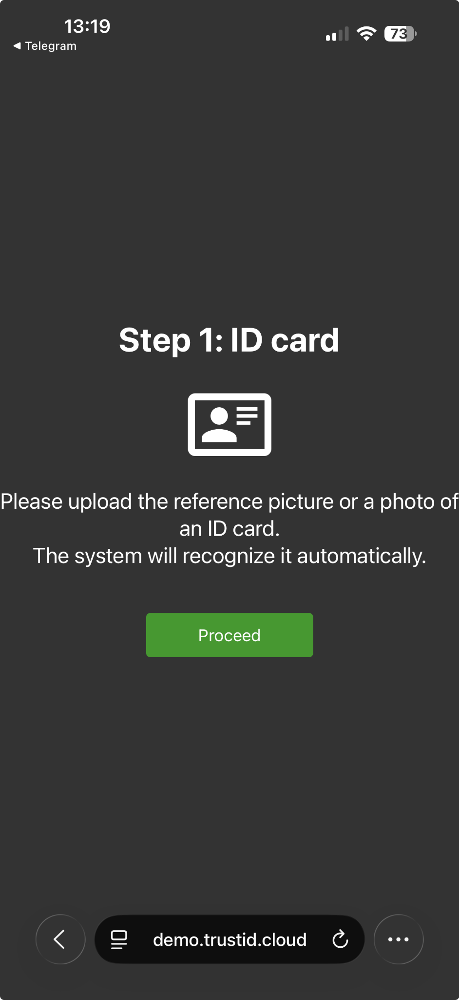
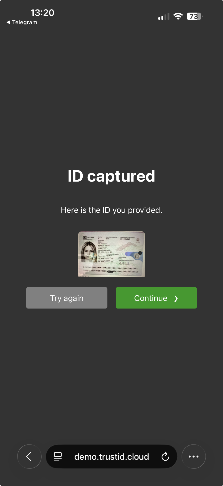
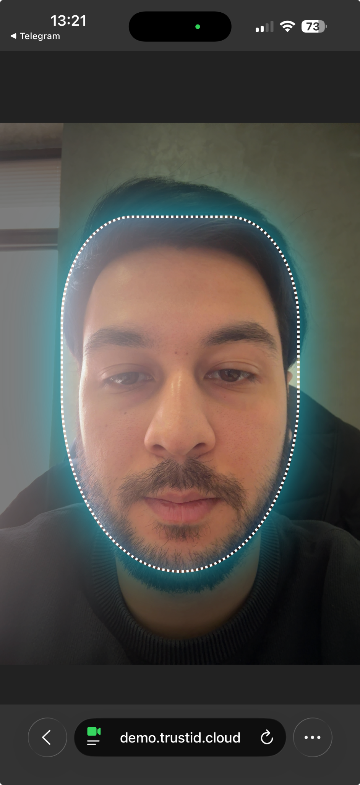
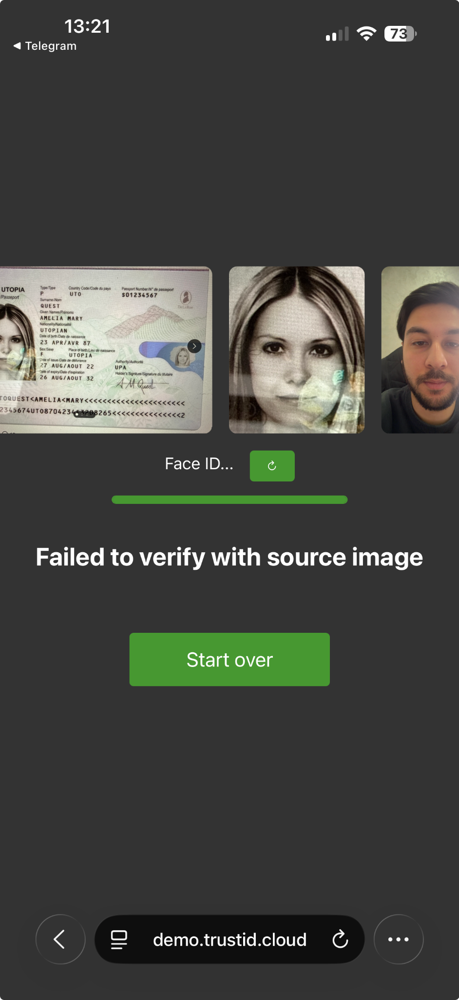

# TrustID — eKYC / Digital Identity Platform (Case Study)

**Role:** Chief Commercial Officer (CCO) — owned product discovery/delivery as **Technical Product Owner** (requirements, architecture decisions, acceptance criteria), working with ML/Backend/Frontend teams.

> Code ownership varies by project: this is a portfolio-friendly case study. Production code, internal models, and client configurations are not shared publicly due to confidentiality and NDA constraints.

---

## Overview

TrustID is an eKYC and digital identity verification platform designed for remote onboarding in regulated environments. The platform supports end-to-end verification flows via UI and API.

Key capabilities:
- ID document capture and validation
- OCR and document parsing
- Face verification (document portrait ↔ selfie)
- Liveness checks (anti-spoof / user actions depending on configuration)
- Decisioning (PASS / FAIL / RETRY) with reason codes
- Cloud API for integration (web/mobile onboarding)

---

## Demo & Public API Documentation

- **Demo portal:** https://demo.trustid.cloud  
  Access note: some demo flows may require credentials. If you are reviewing my portfolio and would like access, please contact me for time-limited reviewer credentials or a guided walkthrough.

- **API documentation:** https://docs.trustid.cloud/#/en/cloud  
  Security note: no API keys are included in this repository.

---

## Screenshots (verification flow)

Place screenshots in this folder and rename them to the filenames below so they render correctly in GitHub:

- `trustid_01_id_card.png`
- `trustid_02_id_captured.png`
- `trustid_03_selfie_capture.png`
- `trustid_04_face_match_result.png`

### Step 1 — ID Card

### Step 2 — ID Captured

### Step 3 — Selfie / Face Capture

### Step 4 — Face Match Result

---

## My contribution (Product / Architecture)

As CCO acting as a Technical Product Owner, my work focused on product delivery and architecture decisions for real-world onboarding constraints.

What I owned:
- Defined verification **flows** and UX behavior (step order, retries, failure states)
- Wrote acceptance criteria for production readiness (quality gates, edge cases)
- Made architecture trade-offs with ML/Backend/Frontend teams (latency vs accuracy, UX vs security)
- Used ML fundamentals to validate outputs and calibrate practical thresholds and failure handling

Note: This entry describes the system at a high level. Sensitive details (client configs, internal endpoints, datasets, model weights) are not published.

---

## Typical integration flow (concept)

1) Create verification session  
2) Upload document images (front/back)  
3) Capture and upload selfie/liveness artifacts  
4) Retrieve verification result and decision (PASS/FAIL/RETRY)  
5) Store audit logs and reason codes (per compliance requirements)

For exact endpoints and request/response formats, refer to the public API documentation linked above.

---

## What is intentionally not included
- API keys / tokens
- Production source code
- Model weights and training datasets
- Client integrations and private configurations
- Any personal identity data

---

## Contact
If you would like demo access or a walkthrough, contact me via GitHub or LinkedIn.
